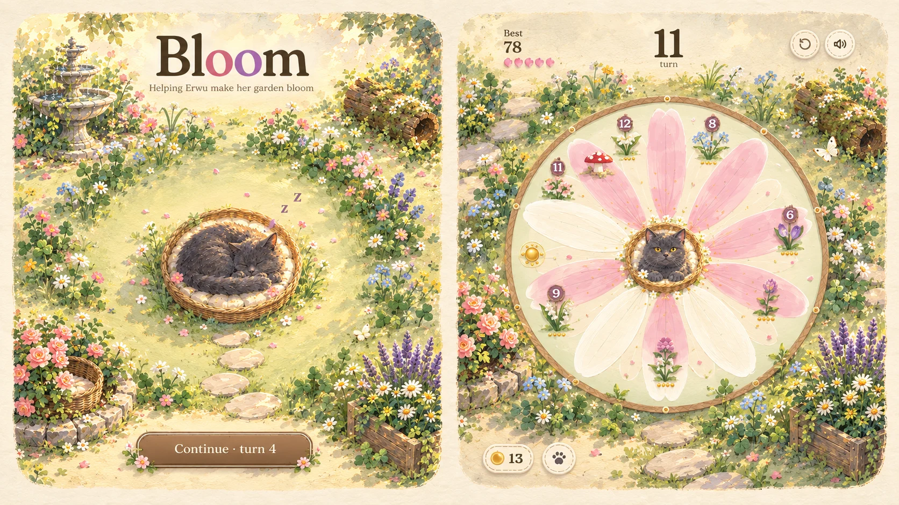

# Art direction: the target

The owner generated `target-mockup.webp` on 2026-09-27 by combining the painted garden with the game's drawn style. It is the art target for both screens. It replaces the painterly naturalism pass: in play, that pass felt too photographic, and the garden and the run felt like one static picture shown twice.

## What makes the mockup work

1. **A storybook illustration, not a painting of a photo.** The forms are simplified, with soft warm-brown outlines. The palette is light and pastel: butter, blush, lilac, cornflower and sage. Texture comes from gentle watercolour washes and paper grain, not fine detail. The flowers are simple, readable shapes. The light is airy and warm, not high contrast.
2. **Erwu belongs to it.** She's the same round, charcoal, amber-eyed cat, drawn with the same soft outline and simplified fur as everything else.
3. **A composed place, not objects on grass.** Dense flower borders frame an open sunlit clearing. The fountain is upper left and the log upper right. The borders fade into a cream paper edge with rounded, deckled corners.
4. **One garden on both screens.** The run is the same garden with the flower you play on laid over the clearing, so starting a run feels like leaning in, not changing games.
5. **The game pieces are drawn in the same language:**
   - watercolour petals, white until they bloom pink
   - painted flower targets, with their counts on small round badges
   - parchment buttons and a wooden sign for Continue

## How it stays alive (the part a mockup can't show)

The scene is built in layers, never baked into one picture, so that everything that should move can move:

| Layer | What's in it | Motion |
|---|---|---|
| Garden plate | Lawn, clearing, fountain, log, paper edge; nothing that moves or is arranged | Slow dappled light drifting across the lawn; shimmering water and droplets in the fountain |
| Border and wild clumps | Separate flower clumps along the edges and wherever play grows them | Each clump sways in the wind at its own phase; drawn in horizontal slices shifted by height, so stems bend and roots stay put. The borders fill in as the garden grows, so the lushness is earned. |
| Beds, cushion, sunny stone, rose bed and basket | The arranged pieces, by growth stage | Flowers in beds sway too; blooms open over time |
| Erwu | Poses and the walk | Everything v0.9 does, plus breathing and blinking from the eyes-closed frames |
| Air | Petals, butterflies, pollen motes (existing, restyled) | Drifting |
| Run | The flower you play on, laid over the same plate and clumps | The garden keeps swaying behind the game |

## Prompts

The complete prompts, ready to copy, are in [`PROMPTS.md`](PROMPTS.md). The existing sheets are restyled with the same layout, so the build tool's regions keep fitting; the backdrop, the flower clumps and the play pieces are new.

## What changes in code when the sheets arrive

Most of this can be built and tested with the current art first, and it looks the same whichever sheets arrive:
- the rounded, deckled paper frame around both screens
- the wind system for clumps and bed flowers
- the run drawn over the same garden as the landing page
- watercolour petals filling the existing petal shapes, so hit areas don't change
- round count badges and parchment and wooden-sign buttons, matching the mockup

When the new sheets arrive, `tools/build-art.cjs` rebuilds the atlases. The clump sheet and the plate are new inputs; the layout's fountain and log positions are then taken from the plate.

## Built before the sheets (2026-09-27)

These work with the current art and carry over unchanged when the sheets arrive. Screenshots are in [`progress/`](progress/).

- **Watercolour petals:** the petal and arena shapes are unchanged, so hit areas are the same. Each is laid over with a warm, fixed watercolour wash, pigment pooled at its edge (pinker once a petal has colour), and a soft warm-brown outline (`run-later-390.webp`).
- **Count badges:** a flower's count sits on a small round badge above it; counts of 2 to 4 stay as gold dots below.
- **One garden behind both screens:** the lawn (the garden backdrop, once it arrives) fills the whole screen on the landing page and in a run. It is washed with paper a little more in a run, with calm light zones where the title and buttons sit, and a rounded, deckled paper edge with pigment pooled just inside it (`garden-390.webp`).
- **Wind:** painted clumps and bed flowers are no longer baked into the garden picture. They're drawn every frame in horizontal strips, bent more the higher they are, with a slow breeze and occasional gusts, calmer while the garden rests, and still under reduced motion. It holds 60 fps in headless Chromium (`wind-difference.webp` shows what moves between two moments).
- **Buttons:** Play and Continue are a painted wooden sign with a grain, a serif label and a sprig at each end; the buttons beside them are parchment.

Waiting on the sheets: the stronger storybook style, the garden backdrop's composition and borders, the variety of clumps (only two for now), and the painted play pieces.

## The storybook sheets are in (2026-09-28)

The owner generated all seven sheets from `PROMPTS.md` (the `-v2` files, `garden-background-v2.png`, `garden-clumps.png`, `garden-beds.png`, `play-pieces.png`). `tools/build-art.cjs` packs them into `erwu.webp`, `garden.webp`, `play.webp` and `garden-plate.webp`. Screenshots: `progress/storybook-*.webp`.

- **Backdrop:** the painted garden fills both screens whole, deckled edge included. Its fountain and log are the backdrop's own; the layout reads where they stand (`scene.scenery`, see `garden-layout.js`), so beds, furnishings and Erwu's walks keep to them.
- **Beds:** each kind flowers in its own painted bed (daisies share the lavender-and-daisy bed). Moonflowers open only in the evening; a blown dandelion is leafy for a few turns.
- **Clumps:** what play grows comes up as a painted clump of its own kind (a leafy tuft while young), and the lawn's edges fill in with flowers as the garden grows. All sway.
- **Run:** painted petals (white, washing pink from the base as they charge, with a soft leading edge), painted buds that open on their last hits, a painted pollen grain, sun, golden seed head and seed pod, and the clean basket. Erwu swats from it with a painted paw and looks delighted after a big shot.
- **Erwu:** the new poses and walk. The walk was generated paler than the poses, so the build matches its colours to theirs.

Still to tune after play on the phone: sizes of pieces against the backdrop, and whether the arena's flat sage disc should become painted too.
